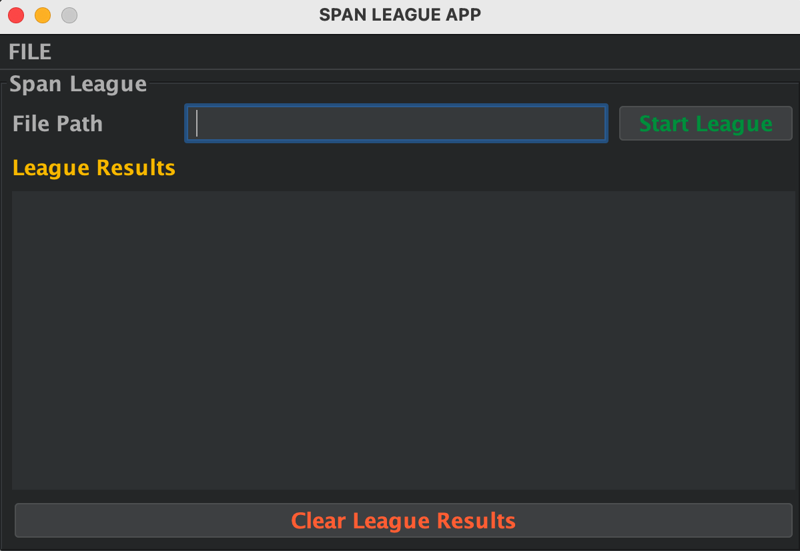
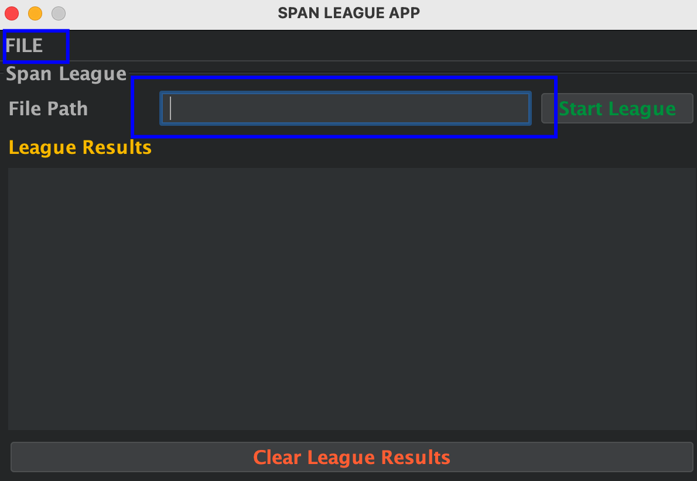
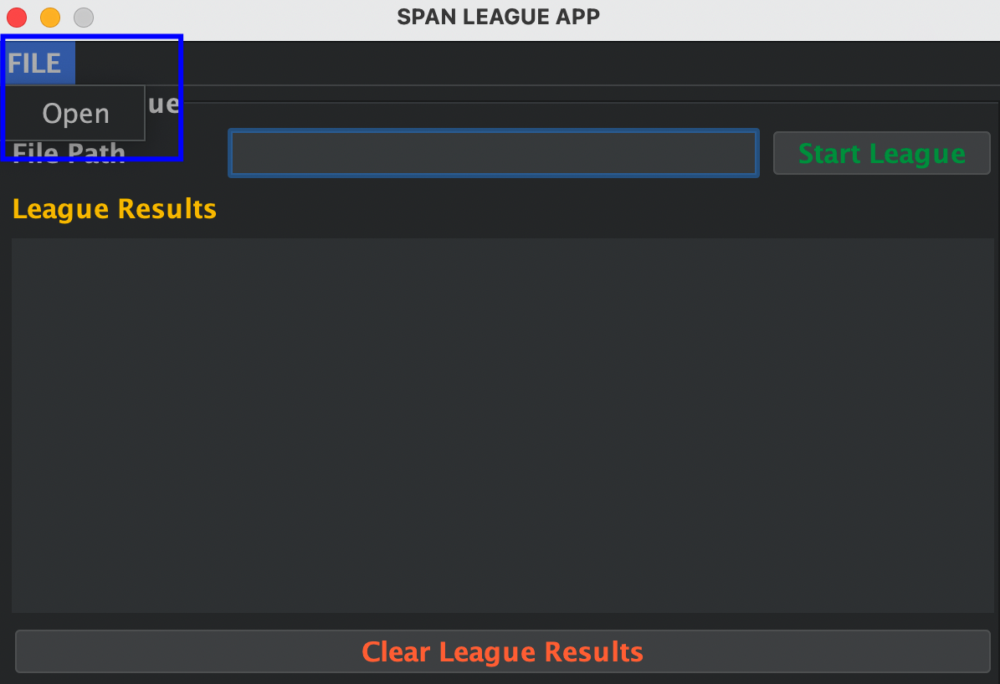
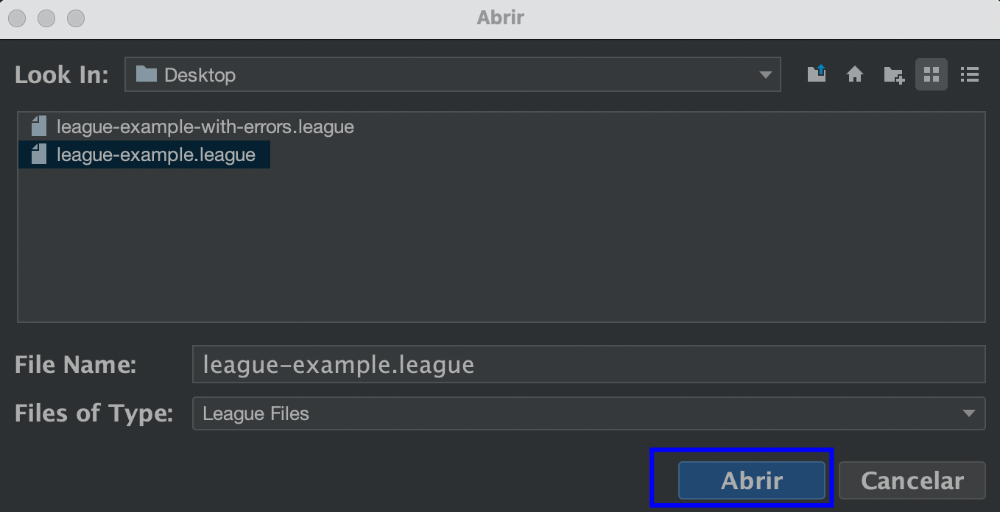
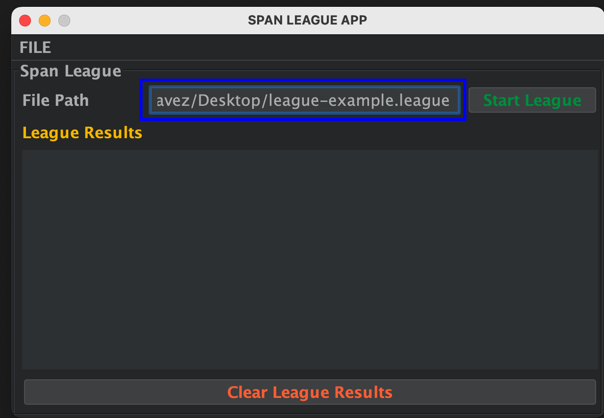
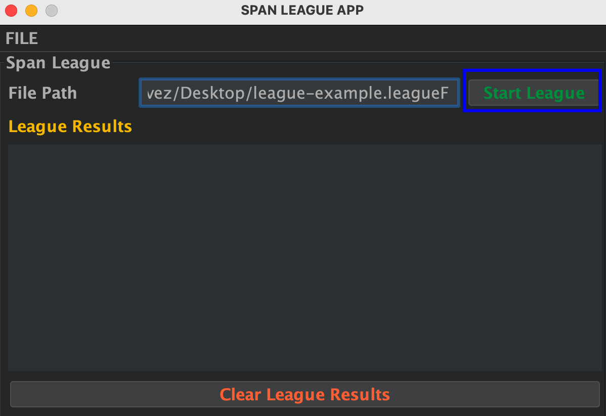
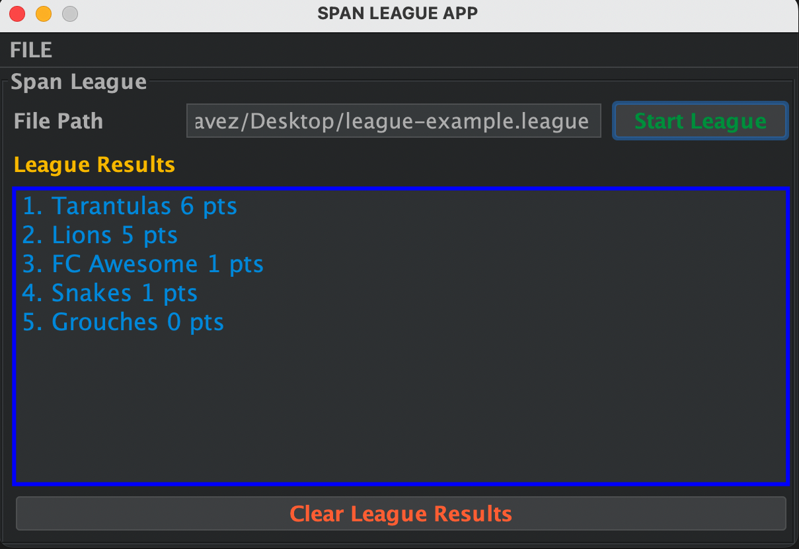
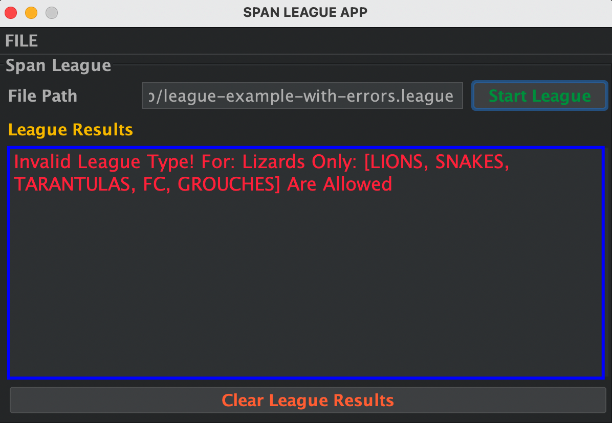

# SPAN LEAGUE APPLICATION #

## Table Of Contents ##
- [SPAN LEAGUE APPLICATION](#span-league-application)
  * [Span League Overview](#span-league-overview)
  * [Span League Compilation](#span-league-compilation)
  * [Compilation Instructions](#compilation-instructions)
    + [Verify the Compilation Results](#verify-the-compilation-results)
    + [VERIFYING THE SPAN-LEAGUE-ENGINE-MODULE WAS GENERATED CORRECTLY](#verifying-the-span-league-engine-module-was-generated-correctly)
    + [VERIFYING THE SPAN-LEAGUE-NON-UI-MODULE WAS GENERATED CORRECTLY](#verifying-the-span-league-non-ui-module-was-generated-correctly)
    + [VERIFYING THE SPAN-LEAGUE-UI-MODULE WAS GENERATED CORRECTLY](#verifying-the-span-league-ui-module-was-generated-correctly)
- [RUNNING SPAN LEAGUE APPLICATION](#running-span-league-application)
  * [Running the Span-League-Non-UI Application](#running-the-span-league-non-ui-application)
  * [Running the Span-League-UI Application](#running-the-span-league-ui-application)

## Span League Overview ##
The Span League Application is an application responsible to read a file that generally has an extension
of _**.league**_, like the examples included in this repo in the _**league-examples-flies**_ folder. Note
that the application accepts _**any text-based**_ file with a different extension of _**.league**_, as long as
contains a valid structure, the _**Span-League-Engine**_ should be able to process the file.

The application is based on a maven multi-module project, which consists of three main projects which compose
the application:

- _**SPAN-LEAGUE-ENGINE**_: Is the Heart of the application responsible to perform all the business logic
  operations regarding the league processing.
- _**SPAN-LEAGUE-NON-UI**_: The Console Application that allows the user run the _**SPAN-LEAGUE-ENGINE**_ through the console
- _**SPAN-LEAGUE-UI**_    : The GUI Application that allows the user run the _**SPAN-LEAGUE-ENGINE**_ through a GUI

The description of the functionality of each module as well as the required instructions to compile each module separately
can be found on the respective README Files of each module located at:

- [SPAN-LEAGUE-ENGINE](Span-League-Engine/README.md)
- [SPAN-LEAGUE-NON-UI](Span-League-Non-UI/README.md)
- [SPAN-LEAGUE-UI](Span-League-UI/README.md)

## Span League Compilation ##

In order to run the application please follow the next instructions, and meet the following requirements:
- _**Apache Maven 3.8.5 or Later**_
- _**Java 18 or later**_

_**IMPORTANT:**_ The following instructions are going to compile the three application modules at once and are
going to generate their respective jar files.

- _**SPAN-LEAGUE-ENGINE**_
- _**SPAN-LEAGUE-NON-UI**_
- _**SPAN-LEAGUE-UI**_

## Compilation Instructions ##
Be sure that you are on the root path of the project and follow the next steps:

``` bash
cd SPAN-LEAGUE/ 
mvn clean install
```

If everything goes well you should see some maven logs indicating that the different modules of the project
are being compiled, at the end of the compilation process you should be able to see something similar to this
output, indicating that the application was correctly compiled.

```
[INFO] ------------------------------------------------------------------------
[INFO] Reactor Summary:
[INFO]
[INFO] Span-League v1.0 ................................... SUCCESS [  0.090 s]
[INFO] Span-League-Engine v1.0.0 .......................... SUCCESS [  1.503 s]
[INFO] Span-League-Non-UI v1.0.0 .......................... SUCCESS [  1.266 s]
[INFO] Span-League-UI v1.0.0 .............................. SUCCESS [  0.645 s]
[INFO] ------------------------------------------------------------------------
[INFO] BUILD SUCCESS
[INFO] ------------------------------------------------------------------------
[INFO] Total time:  3.546 s
[INFO] Finished at: 2022-05-16T19:10:11-05:00
[INFO] ------------------------------------------------------------------------
``` 

### Verify the Compilation Results ###
If you want to verify that jars were generated correctly, follow the next instructions:

### VERIFYING THE SPAN-LEAGUE-ENGINE-MODULE WAS GENERATED CORRECTLY ###
Ensure that a jar file called _**Span-League-Engine.jar**_ was generated running the next commands:

``` bash
 ls -l Span-League-Engine/target
 
 # An output similar to this one, should show you that the Jar file was Generated correctly 
 # look for Span-League-Engine.jar which is the dependency of the console application
 #
 # -rw-r--r--  1 Foo  Foo   4.2M May 16 17:17 Span-League-Engine.jar
 # drwxr-xr-x  3 Foo  Foo   102B May 16 17:17 classes/
 # drwxr-xr-x  3 Foo  Foo   102B May 16 17:17 generated-sources/
 # drwxr-xr-x  3 Foo  Foo   102B May 16 17:17 maven-archiver/
 # drwxr-xr-x  3 Foo  Foo   102B May 16 17:17 maven-status/
 # -rw-r--r--  1 Foo  Foo    22K May 16 17:17 original-Span-League-Engine.jar
```

### VERIFYING THE SPAN-LEAGUE-NON-UI-MODULE WAS GENERATED CORRECTLY ###
Ensure that a jar file called _**Span-League-Non-UI.jar**_ was generated running the next commands:

``` bash
 ls -l Span-League-Non-UI/target

 # An output similar to this one, should show you that the Jar file was Generated correctly 
 # look for Span-League-Non-UI.jar which is the console application that we want to run
 #
 # -rw-r--r--  1 Foo  Foo   4.3M May 16 17:29 Span-League-Non-UI.jar
 # drwxr-xr-x  4 Foo  Foo   136B May 16 17:29 classes/
 # drwxr-xr-x  3 Foo  Foo   102B May 16 17:29 generated-sources/
 # drwxr-xr-x  3 Foo  Foo   102B May 16 17:29 maven-archiver/
 # drwxr-xr-x  3 Foo  Foo   102B May 16 17:29 maven-status/
 # -rw-r--r--  1 Foo  Foo   3.8K May 16 17:29 original-Span-League-Non-UI.jar
```

### VERIFYING THE SPAN-LEAGUE-UI-MODULE WAS GENERATED CORRECTLY ###
Ensure that a jar file called _**Span-League-UI.jar**_ was generated running the next commands:

``` bash
 ls -l Span-League-UI/target

 # An output similar to this one, should show you that the Jar file was Generated correctly 
 # look for Span-League-UI.jar which is the GUI application that we want to run
 #
 # -rw-r--r--  1 Foo  Foo   4.9M May 16 18:31 Span-League-UI.jar
 # drwxr-xr-x  4 Foo  Foo   136B May 16 18:31 classes/
 # drwxr-xr-x  3 Foo  Foo   102B May 16 18:31 generated-sources/
 # drwxr-xr-x  3 Foo  Foo   102B May 16 18:31 maven-archiver/
 # drwxr-xr-x  3 Foo  Foo   102B May 16 18:31 maven-status/
 # -rw-r--r--  1 Foo  Foo    15K May 16 18:31 original-Span-League-UI.jar
```

# RUNNING SPAN LEAGUE APPLICATION #
Once that 3 modules of the application were compiled, you have 2 options to run the application:

- [SPAN-LEAGUE-NON-UI](Span-League-Non-UI/README.md) Which is a Console Application
- [SPAN-LEAGUE-UI](Span-League-UI/README.md) Which is the GUI Application

## Running the Span-League-Non-UI Application ##

Once that you have the application compiled, run the application following the next steps:

``` bash
java -jar Span-League-Non-UI/target/Span-League-Non-UI.jar <PATH_TO_LEAGUE_FILE>

# NOTE REMEMBER REPLACE THE TOKEN <PATH_TO_LEAGUE_FILE> WITH A VALID PATH IN FILESYSTEM LIKE:
java -jar Span-League-Non-UI/target/Span-League-Non-UI.jar /Users/foo/Desktop/league-example.league 
```

_**REMEMBER**_ if you need to get a valid simulation league file, you can get it from:_
- [SPAN-LEAGUE-FILES](league-examples-flies)

If the league simulation ran successfully you should see an output showing you the results of
the league simulation like this one:

```
#########################################
#        WELCOME TO SPAN LEAGUE         #
#########################################
2022-05-16T17:38:18,053 [span-league-non-ui-log] INFO  [main] com.span.league.engine.loader.LeagueLoader.loadLeagueFromFile:94 - League File Received: /Users/oachavez/Desktop/league-example.league
2022-05-16T17:38:18,054 [span-league-non-ui-log] INFO  [main] com.span.league.engine.loader.LeagueLoader.loadLeagueFromFile:98 - Loading Simulation From File: /Users/oachavez/Desktop/league-example.league
2022-05-16T17:38:18,057 [span-league-non-ui-log] INFO  [main] com.span.league.engine.LeagueEngine.runLeague:104 - Running League Simulation...
2022-05-16T17:38:18,058 [span-league-non-ui-log] INFO  [main] com.span.league.engine.LeagueEngine.runLeague:107 - SUCCESS! League Simulation Finished With: 
1. Tarantulas 6 pts
2. Lions 5 pts
3. FC Awesome 1 pts
3. Snakes 1 pts
4. Grouches 0 pts
```

## Running the Span-League-UI Application ##
Once that you have the application compiled, run the application following the next steps:

``` bash
 java -jar Span-League-UI/target/Span-League-UI.jar 
```
**Step#01** A UI Should be displayed like the below image


**Step#02** introduce the file path of the league file directly on the Text Filed or choose a path 
through a file chooser in the file menu.


**Step#03** To Open the File Chooser press the file menu and then the Open Menu


**Step#04** A file Chooser appears, navigate through the file system of your computer and choose a
valid league file, once that you found the required file press the open button.

_**REMEMBER**_ if you need to get a valid simulation league file, you can 
get it from:
- [SPAN-LEAGUE-FILES](league-examples-flies)



**Step#05** The File Text box is updated with the path of the file that you chose previously on the
**Step#04**.


**Step#06** Finally _**press the start league button**_ to start the simulation


**Step#07** The Results of the simulation are shown in the UI and you can validate if the process
finished successfully or not.


**NOTE** If an error happens during the simulation, instead of the results you are going to see 
the error code and description in the same area.

